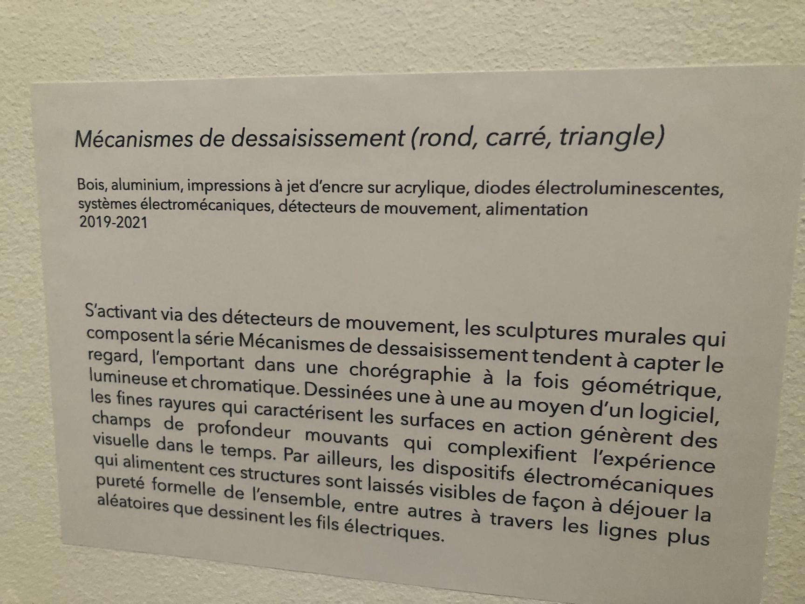
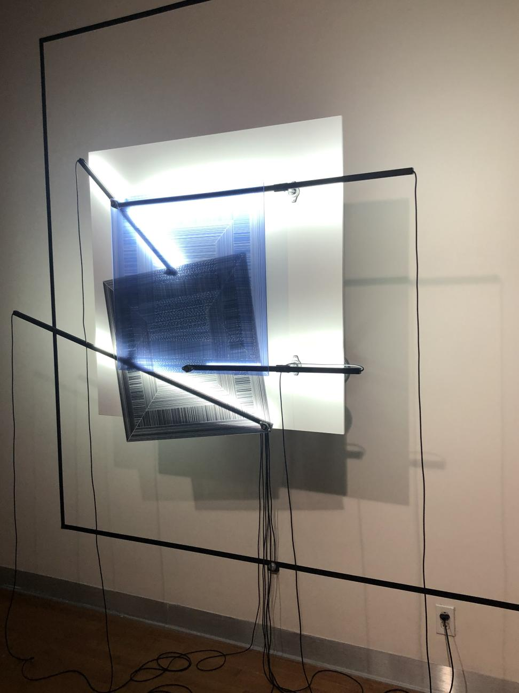

# MÉCANISMES DE DÉSSAISISSEMENT
## ARTISTES 
Catherine Béchard et Sabin Hudon
## ANNÉE DE RÉALISATION
2019 à 2020
## NOM DE L'EXPOSITION  
Configuration du sensible 
## LIEU DE MISE EN EXPOSITION 
Alfred-Pellan 
## DATE DE MA VISITE  
Mercredi le 16 mars 2022
## DESCRIPTION 
Mécanismes de déssaisissement est un exposé composée de 3 sculptures murales géométriques et cinétique qui émet des vibrations. Chacun de ces installations est propre à lui, le premier un carré bleu, le deuxième un triangle rouge et le troisième un cercle vert. Lorsque le carré bleu croire le carré noir, une illusion se forme et emet des vibrations dans le corp ce qui deviens hypnotisant a regarder. Le cablage de chaque installation est visible et une ombre noir de la forme qu'on regarde est projeté sur le mur. L'installation semble faire une boucle infini.

## EXPLICATION 
La structure bouge en formant une boucle sans fin et lorsque les formes se croise une illusion apparait.

## COMPOSANTES ET TECHNIQUES 
- Production web 
- Espace intéractif   
## ÉLÉMENTS NÉCESSAIRES 
- Câbles 
- moteur électriques
- Courois
- cercle en vitre
- prises électriques  
- lumières
- 
## EXPÉRIENCE  
La sculpture nous amène à rester près de l'oeuvre, car celle-ci bouge et permet de diffiérente forme et vibration.  
## CE QUE J'AI AIMÉ 
J'ai aimé cette oeuvre, parce qu'elle me fesait penser aux éléments. Le carré bleu me faisait pensé a l'eau et la mer, Le triangle rouge au feu et à la chaleur et le cercle vert a la terre et la planète. 

## CE QUE JE N'AI PAS AIMÉ 
J'ai moins aimé qu'on voyaient tous les cables et fil, car j'avais l'impression que l'oeuvre n'était pas terminer.

