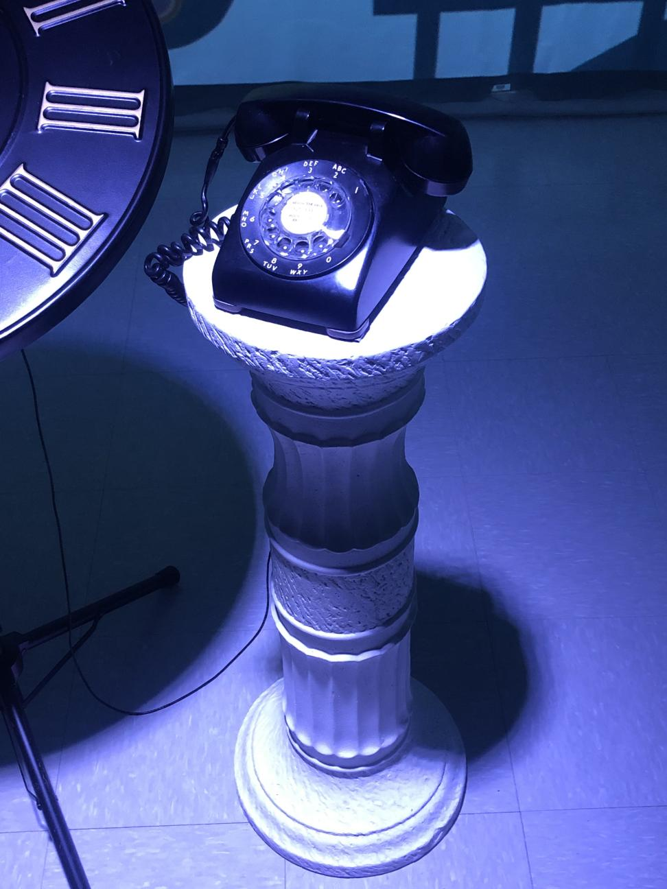

# Horloge de l'apocalyspe 

## Artistes
Maxime Sabourin, Louis-Philippe Gravel, Alexis Lacasse, Tristan Girard-Montpetit et Maxime De Falco
## Années de réalisation
2021-2022
## Lieu de mise en exposition
Cegep Montmorency dans le petit studio
## Date visite
23 Mars 2022 
## Description 
Ce projet représente l'impact collectif sur les évènements socio-politique et environnementaux qui ce produise tout au long du temps de l'humanité. L'équipe aborde ce sujet à travers le concept de l'horloge de l'apocalypse. Selon ce concept, il est présentement 23h58 et la fin du monde est a 24h.

## Explication de la mise en espace
Le spectateur entre dans la pièce, il peut bouger les aiguilles de l'horloge a son aise pour avancer ou reculer dans le temps et observer les changements négatifs qu'on doient empêcher avant qu'il ne soit trop tard. 

## Description de mon expérience
Lorsque je suis entré dans la pièce une voix de femme a commencer à parler nous expliquant comment intéragir avec l'oeuvre. Ensuite il faut tourné l'horloge à notre aise pour que les scènes joue, on peut retourner en arrière sans aucun problème.Lorsqu'on atteint la 12ème heure le téléphone sonne nous anoncant la fin du monde. J'ai bien aimé intéragir avec l'horloge et regarder les différente scènes comme si j'était dans un film.  

## Liste des composantes techniques
- Audio:
  4 haut-parleurs,
  8 fils XLR 3,
  Focusrite carte de son
- Vidéo:
  3 projecteurs vidéo lentille ultra wide 0.3,
  3 systèmes d'acrochage,
  1 caméra sony a6500
- Lumière:
  1 projecteur de lumière couleur,
  2 fils XLR 3 conducteur de 20,
  Console DMX USB,
  Interface DMX USB
- Électricité:
  8 cordons IEC,
  2 extention 3 fiche et 3 conducteur,
  2 multiprise
- Réseau:
  5 fils ethernet
- Ordinateur:
  1 ordinateur ou 2,
  2 micro-controleur (Arduino)
- Autres:
  Kit de camera,
  Kit de détection de présence,
  1 potentimètre,
  Toile blanche, 
  1 bouton,
  8 safety
  
  
  
## Liste élément néccessaire 
- Téléphone à roulette
- Piedestal romain
- Horloge
- Sac de sable 

## Ce que j'ai aimé
Ce que j'ai le plus aimé de ce projet sont les projection sur le murs, Les illustrations sont très bien fait et j'aime le style qui nous plonge dans l'univers imaginaire. J'aime aussi beaucoup le décor avec le piedestal l'horloge et le téléphone 
## Ce que je n'ai pas aimé 
Ce que j'ai moins aimé est l'introduction qui est selon pas pas très clair de comprend on doit intéragir avec l'oeuvre. 

