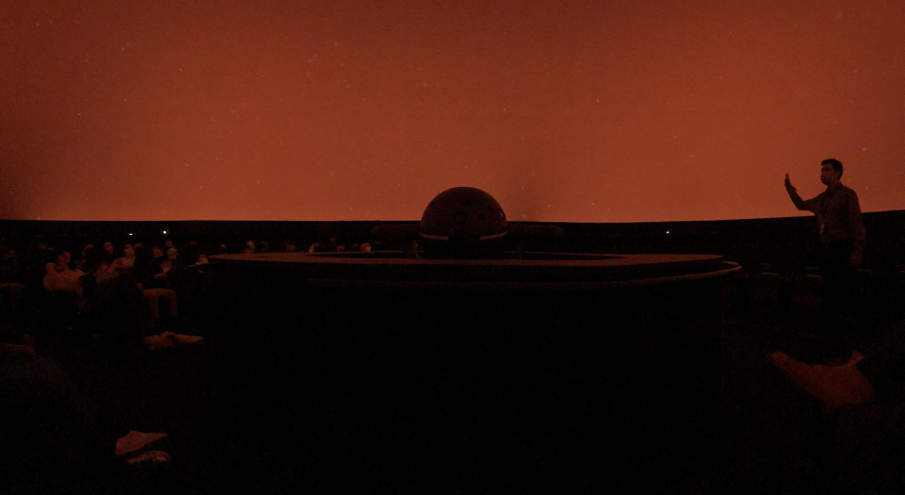
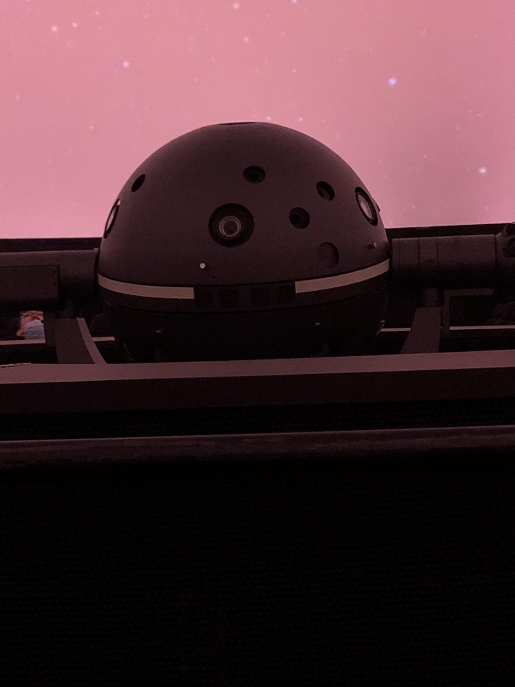

# Les chroniques celeste et les sondes voyager

## Artistes
Le planétarium Rio Tinto Alcan lui même
## Années de réalisation
2021-2022
## Lieu de mise en exposition
Planétarium Rio Tinto Alcan 
## Date visite
17 Avril 2022
## Description 
Dans la première partie, un animateur nous présente les trésors de la galaxie et nous explique le fonctionnement des astres et de l'astrologie. Sous un dôme de 360 degré se trouve une expérience immersive dans le temps et l'espace. Nous observerons étoiles, planètes, constellations, lune et actualité astronomique. Dans la deuxième partie un film sur les sondes voyager qui racconde l'histoire passionnante de la mission spaciale la plus remarquable de l'histoire En 1977, deux sondes spatiales ont été lancées pour explorer des planètes loingtaine du Système solaire. Jupiter, Saturne, Uranus et Neptune et leurs lunes. Ces vaisseaux spatiaux ont grandement enrichi notre connaissance des mondes lointains. Maintenant, après quatre décennies, ils explorent l'espace infini.

## Explication de la mise en espace
L'oeuvre est mis en place dans un dôme a 360 degré et les sièges sont en rond et incliné vers le plafond. au milieu il y a un projecteur en forme de planète et sur le plafond il y a une toile noir pour les images et les films. il y a des haut-parleur pour bien entendre l'animateur.  
## Description de mon expérience
 Je trouve que l'expérience est très ressoursante et paisible. L'animateur connais son millieu  et il est évocateur.   
## Liste des composantes techniques
- Ordinateur
- fils et câbles
- projecteur
- haut-parleur
- lumières
- toile blanche 
  
## Liste élément néccessaire 
- siège orienté vers le plafond 
- dòme de 360 degré
- micro
## Ce que j'ai aimé
J'ai aimé la partie portant sur les chroniques celeste, car elle nous explique l'univers dans un style confortable. 
## Ce que je n'ai pas aimé 
J'ai moins aimé la partie sur les sonde voyager, car dépendamment de ou nous somme placédans la salle, il est difficile de voir le film. 
